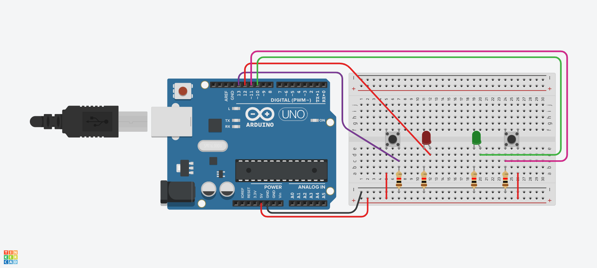

<h1 align="center">🎮 Jogo Passa ou Repassa - Arduino</h1>

<p align="center">
  
  
</p>

---



---

### 🕹️ Sobre o Projeto

Este projeto é uma versão simples e divertida do clássico **Passa ou Repassa**, desenvolvida com **Arduino UNO**. Dois jogadores disputam apertando botões — e o primeiro a apertar acende o LED da sua cor! Após isso, o jogo "trava" por alguns segundos antes de reiniciar.

---

### ⚙️ Componentes Utilizados

- 1x Arduino UNO
- 1x Botão Vermelho
- 1x LED Vermelho
- 1x Botão Verde
- 1x LED Verde
- Jumpers
- Protoboard

---

### 🔁 Como Funciona

- 🟥 Se o jogador vermelho apertar o botão primeiro, o LED vermelho acende.
- 🟩 Se o jogador verde apertar primeiro, o LED verde acende.
- ⏱️ Após 5 segundos (tempo de bloqueio), os LEDs apagam e o jogo reinicia.

---

### 💻 Código

O código está incluso neste repositório no arquivo `passa_ou_repassa.ino`. Simples e fácil de adaptar!

```cpp
const int redButton = 13;
const int redLed = 12;
const int greenButton = 11;
const int greenLed = 10;
const int lockTime = 5000;

// Código completo disponível no repositório!
